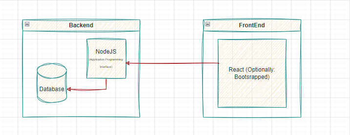

# 2023 Hackathon: Gamified Health App - Logic Legends

---

| Picture | Name (Nickname)      | Role(s)      |
|---------|----------------------|--------------|
|  | Dan Phala (DanPhala)            | Developer & Designer |
|  | Bandisa Masilela (Keyboard warrior) | Developer & Designer |
|  | Selepe Sello (TebogoYungMercyKay) | Developer & Designer |
|  | Tumelo Mosomane (Mozocs)         | Developer & Designer |

---

- ## `Introduction:`

    - In the modern digital landscape, health apps have the potential to transform the way individuals manage and maintain their well-being.
    - However, many existing health apps lack the engagement factor necessary to encourage consistent usage.
    - This README outlines the vision, challenges, and objectives of our upcoming health app project, with a strong emphasis on integrating gamification principles to enhance user engagement and enjoyment.

    ---

    - #### `Hackathon Objective:`

        - Our primary objective is to develop a health app that seamlessly integrates gamification principles, making it easy for users to incorporate it into their daily routines for health monitoring, education, and support.
        - Gamification has proven to be a vital tool for boosting user engag

        - ###### `Key Gamification Principles:`

            - Clear Goals and Challenges: Users should have well-defined objectives and challenges to strive for within the app.
            - Personalization: Tailoring the user experience to individual preferences and needs.
            - Immediate Feedback: Providing instant and visible feedback on user actions and progress.
            - Choice and Failure: Offering users choices and the possibility of setbacks or failures in their health journey.
            - Social Interaction: Encouraging social engagement and interaction among users

    - #### `Project Vision and Goals:`

        - Enhancing User Engagement: Traditional health apps often lack engaging elements, leading to inconsistent use.
        - Comparative Health Tracking: Users struggle to compare their progress with others, which can be motivating.
        - Motivation Reinforcement: Users who achieve personal goals should receive recognition and encouragement.
        - Health Improvement Push: Existing apps often focus on monitoring, rather than actively prompting users to make improvements.
        - User-Friendly Interface: Ensuring that the app is accessible and user-friendly for individuals of all tech-skill levels.

    - #### `Objectives:`

        - Health Data Input: Allow users to input various health data, such as weight, water intake, steps taken, etc.
        - Comparative Health Tracking: Enable users to compare their health status and progress with peers.
        - -Friendly Tutorial: Provide a user-friendly tutorial to ensure easy onboarding for all users.
        - Personalized Health Challenges: Implement a system that issues personalized health challenges based on user profiles and goals.
        - Reward System: Create a reward system to recognize and incentivize users for achieving their health goals.
        - Communication with Medical Professionals: Establish a communication channel for users to connect with healthcare professionals for guidance and support.

---
---

- ## `Implementation Proposal:`

    ---

    - ### `Technologies Used:`
        - Frontend: React, `(Add More)`.
        - Backend: Node, `(Add More)`.

    ---

    - ### `OVERVIEW:`

        - ### `Diagram:`

            - 

        - ### `Database Design:`

            - `Loading...`

    ---

    - ### `Pages and Their Functionality:`

        ---

        - #### `Landing page/ Splash Page:`

            - ###### `Description:`

                - This is a splash page or landing page serves as the initial screen or web page that users encounter when they first open the app or visit your website.
                - This plays a crucial role in making a first impression, conveying important information, and encouraging users to take specific actions.

            - ###### `Feature in our App:`

                - We'll use this to showcase the key features and benefits of your app.
                - Highlight what sets your app apart from others and why users should continue using it.
                - All unregistered users or even registered ones before logging in will land/be here.

        ---

        - #### `Registration and Login:`

            - ###### `Description:`

                - The registration and login process is a fundamental component of many digital applications, including your gamified health app.
                - It's important to make this process smooth, secure, and user-friendly:

            - ###### `Feature in our App:`

                - Registration Page: Allows users to create an account with their personal information.
                - Login Page: Enables users to log in with their credentials.

        ---

        - #### `Posts:`

            - ###### `Description:`

                - This page in our gamified health app can be an effective way to share valuable content, updates, and engage with your user community.
                - It will also motivate other users to keep up and participate more in challenges.

            - ###### `Feature in our App:`

                - Challenge winners might post their journey and tactics here.
                - Users will post and brag about their health here.
                - And also view posts from other users.
                - Future Improvements:
                    - Likes
                    - Comments and tags

        ---

        - #### `Dashboard:`

            - ###### `Description:`

                - Displays a summary of the user's health data and progress, providing a quick snapshot of their current status.
                - This might Include visualizations like charts or graphs to show trends in their health data over time.

            - ###### `Feature in our App:`

                - Progress Tracking:
                    - Within the dashboard, have a section where users can dive deeper into their health data. This can include historical data, trends, and insights.
                - Challenges:
                    - Integrates the list of active challenges directly into the dashboard. Users can see ongoing challenges, their progress, and upcoming challenges.
                    - Optional: Include a "Join Challenge" or "Start Challenge" button for easy participation.
                    - Progress bar and point system for task completion.
                - Tutorials:
                    - We will add a dedicated section or card on the dashboard for tutorials and educational content.
                    - Users can access tutorials related to health, fitness, nutrition, or app features directly from the dashboard.

        ---

        - #### `Leaderboard:`

            - ###### `Description:`

                - A "Leaderboard" is a popular feature in gamified apps that can encourage competition, engagement, and motivation among users.
                - It ranks users based on their performance or achievements in various challenges or activities within the app.

            - ###### `Feature in our App:`

                - We will Rank Users from first to last based on Health Points in table form.
                    - Allow users to filter the leaderboard by various criteria.
                    - Sorting options so users can view the leaderboard based on different parameters like points, steps taken, or challenge participation.
                - The top 3 Winners for Challenges will be listed here.
                    - Highlight top-performing users with special badges, icons, or recognition.
                    - For example, a "Top Challenger of the Month" badge.
                - Display the rewards or prizes that users can earn for reaching specific leaderboard positions.
                - This will allow users to Compare themselves with Others.

        ---

        - #### `Events Page:`

            - ###### `Description:`
                - This can be a valuable way to promote community engagement, provide users with information about health-related events, and encourage participation in various wellness activities.

            - ###### `Feature in our App:`

                - Event Listings:
                    - Display a list of upcoming health and wellness events, workshops, classes, or seminars.
                    - Include essential details for each event, such as the event name, date, time, location, and a brief description.
                - Filtering and Sorting:
                    - Implement filters and sorting options to help users find events that match their interests, location, or preferred dates.
                    - Allow users to filter events by category, such as fitness, nutrition, mental health, or community events.
                - Event Details:
                    - When a user clicks on an event listing, provide a dedicated page with comprehensive event details, including a more extensive description, speaker or instructor information, and registration or ticketing options.

        ---

        - #### `DoctorsPortal:`

            - ###### `Description:`

                - Enables users to search for nearby medical professionals and connect with them for advice or appointments.

            - ###### `Feature in our App:`

                - Nearby doctor search.
                - Communication with medical professionals

        ---

        - #### `Settings:`

            - ###### `Description:`

            - ###### `Feature in our App:`

                - User-set goals
                - User input of health data (Weight, Water Intake, Steps, Sleep time, Avg daily Temparature and Heart Rate & Blood Pressure).
                - The Inputs are a Score out of 100.
                - User Reset Passwords.
                - Edit profile.
                - Delete account.
                - Theme preferences (Optional).

        ---

---

- ## `Requirements Before Running Code:`

    - Coming Soon!!

---
---

The End, Thank You

---
---
